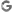
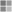

# MAUI Controls

## form related controls - ca.whittaker.Maui.Controls.Forms

### **Form**

- Incorporates TextBox and CheckBox.
- Integrates Save and Cancel buttons automatically.

### **TextBox**

- ***Types***:
  - Text
  - Email
  - Url
  - Chat
  - Username
- **Filtering Options**:
  - AllLowerCase
  - AllowWhiteSpace
  - Mandatory
- **Built-in Functionalities**:
  - "Undo" button for reverting text entries.
  - Label for descriptions or titles.
  - Notification message area for displaying input-related messages.

#### **CheckBox** ***(Planned)***
> A future addition to enhance the Form control collection.

## button related controls - ca.whittaker.Maui.Controls.Buttons

### Button embedded graphics by class

| Button Class    | enabled | disabled |
|-----------------|:-------:|:--------:|
| CancelButton    |  |  |
| UndoButton      |  |  |
| SaveButton      |  |   |
| SigninButton    |  |  |
| SignoutButton   |  |  |

### SigninButton class specialized types

| SigninButtonType | enabled | disabled |
|-----------------|:-------:|:--------:|
| Tiktok          |  |  |
| Facebook        |  |  |
| Google          |  |  |
| Microsoft       |  |  |
| Apple           |  |  |


> **Note:** Buttons include embedded graphic icons for specific purposes, with "enabled" and "disabled" state graphics to reflect the button's active state in relation to its environment.

This comprehensive structure offers a detailed view of the enhanced functionalities and user interaction mechanisms in the custom MAUI application, focusing on form management and control interactions.

## Usage

To integrate the Form class into your .NET MAUI application, follow these steps:

Step 1. ***Adding the Form to Your View***

Incorporate the Form class in your XAML where you need a form. Make sure to reference the namespace ca.whittaker.Maui.Controls.Forms.

XAML Example:
```xml
<ContentPage xmlns="http://xamarin.com/schemas/2014/forms"
             xmlns:x="http://schemas.microsoft.com/winfx/2009/xaml"
             xmlns:forms="ca.whittaker.Maui.Controls.Forms"
             x:Class="YourNamespace.YourPage">
    <forms:Form x:Name="myForm"/>
</ContentPage>
```

Step 2. ***Configuring the Form***

You can configure various aspects of the form directly in XAML. Set properties such as FormName, FormSaveButtonText, and FormCancelButtonText to customize the form's appearance and behavior.

Example of Setting Properties:

```xml
<forms:Form x:Name="myForm"
            FormName="User Details"
            FormSaveButtonText="Submit"
            FormCancelButtonText="Reset" />
```

Step 3. ***Binding Commands and Parameters***

Bind commands and parameters to handle actions like saving data or canceling the form operation. Use the Command and CommandParameter properties for this purpose.

Example of Command Binding:
```xml
<forms:Form x:Name="myForm"
            Command="{Binding SaveCommand}"
            CommandParameter="" />
```

Step 4. ***Customizing Appearance***

Customize the appearance of the form by setting properties like FormNameTextColor and FormSize.

Example of Customizing Appearance:
```xml
<forms:Form x:Name="myForm"
            FormNameTextColor="Blue"
            FormSize="Large" />
```

By following these steps, you can effectively incorporate and customize the Form class in your .NET MAUI application using XAML.

Step 5. ***Adding the Form to Your View***

Incorporate the Form class in your XAML where you need a form. Make sure to reference the namespace ca.whittaker.Maui.Controls.Forms.

```xml
<ContentPage xmlns="http://xamarin.com/schemas/2014/forms"
             xmlns:x="http://schemas.microsoft.com/winfx/2009/xaml"
             xmlns:forms="ca.whittaker.Maui.Controls.Forms"
             x:Class="YourNamespace.YourPage">
    <forms:Form x:Name="myForm"/>
</ContentPage>
```


# Author

Brett Whittaker - brett@whittaker.ca

- https://github.com/bwhittaker69
- https://tiktok.com/@cowboycanadian
- https://www.linkedin.com/in/brettdouglaswhittaker